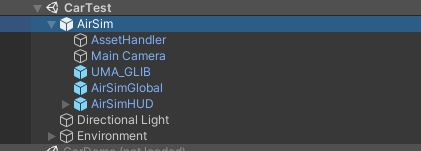
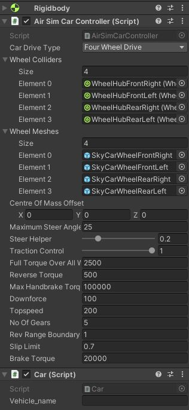
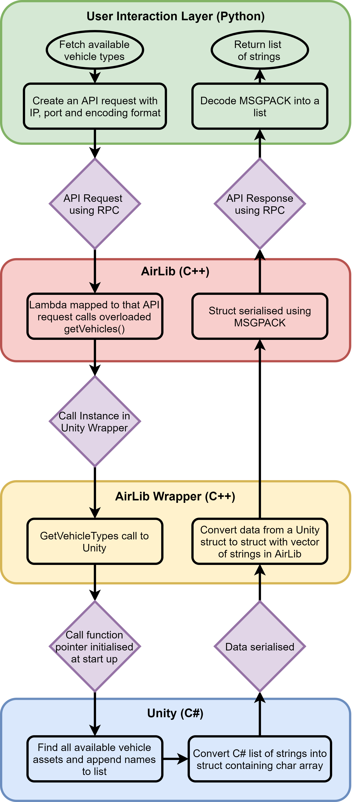
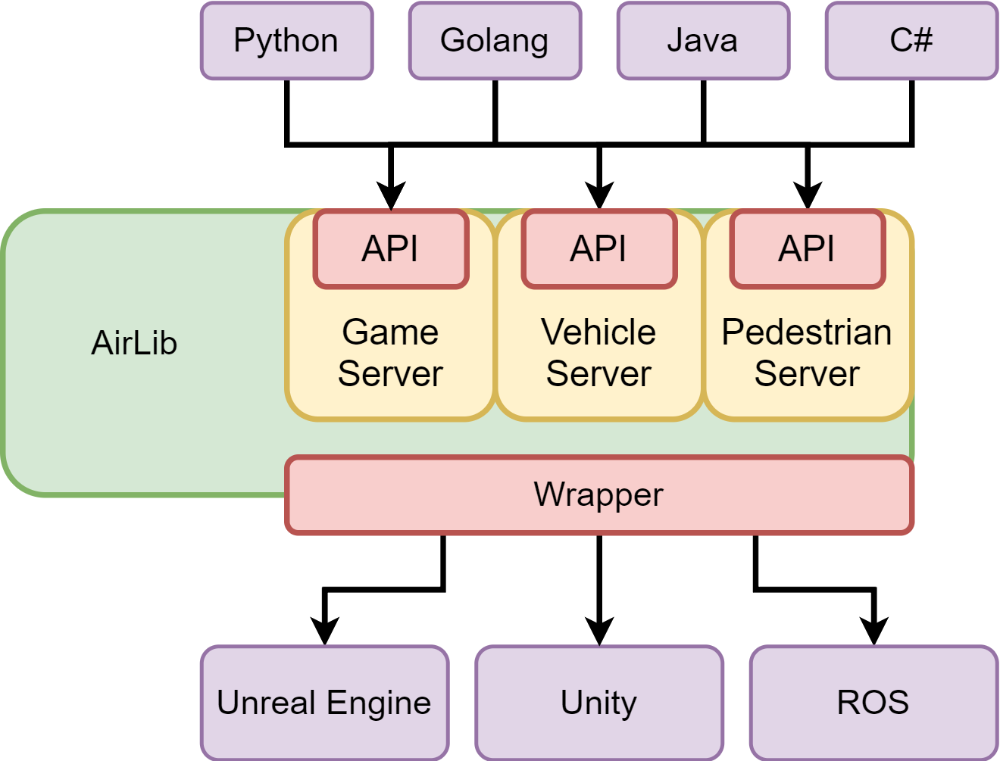

# AirSim - Final Year Project 2021
This is the code repository for my final year project titled "_Mixed Traffic Simulation for Autonomous Systems in Shared Spaces_". The project extends the existing [AirSim](https://github.com/microsoft/AirSim) simulator created by Microsoft.

The project looks at extending AirSim to include mixed forms of traffic. This includes running several entities simultaneously, adding pedestrians to the simulator and making the simulator simpler to extend. A large range of APIs are also added. The simulator expands the current Unity prototype build. The changes can be found inside the [Unity directory](https://github.com/tobhil98/MastersProject-AirSim/tree/master/Unity), which contains the [Unity project](https://github.com/tobhil98/MastersProject-AirSim/tree/master/Unity/UnityDemo) and the [AirLib wrapper](https://github.com/tobhil98/MastersProject-AirSim/tree/master/Unity/AirLibWrapper), the [AirLib directory](https://github.com/tobhil98/MastersProject-AirSim/tree/master/AirLib), and the [PythonClient directory](https://github.com/tobhil98/MastersProject-AirSim/tree/master/PythonClient).

The report and documentation can be found [here](https://github.com/tobhil98/FinalYearProject-TobyHillier). 

## Building AirSim
Build the project as specified [here](#how-to-get-it). 

After the project has built, [UMA2](https://assetstore.unity.com/packages/3d/characters/uma-2-unity-multipurpose-avatar-35611) has to be downloaded from the Asset store.
If this was not done automatically, as if for example Unity was running, run the build script inside `Unity/build`. This will build the AirLib DLL. 

## Extending AirSim
### How to make any scene an AirSim environment
For a scene to be an AirSim environment, simply drag the AirSim prefab from the prefab directory into the scene as shown in the image below. Make sure that UMA2 is installed and that the AirLib DLL is in the plugin directory. 



As can be seen, the AirSim prefab consists of 5 components.
1. AssetHandler - This is where the available vehicle models should be added. This can be extended for other entities as well. 
2. Main Camera - This consists of the free-moving camera script and the entity tracking script.
3. UMA_GLIB - Is the rendering prefab for UMA2
4. AirSimGlobal - Contains global AirSim configurations as well as the game server controls.
5. AirSimHUD - Consists of the simulator HUD.  

### Adding additional vehicles
There are two ways of doing this.
1. Method one is to use the existing AirSim car controller script to control the vehicle and the car script for the logic and interaction with the vehicle companion. Simply attaching these two scripts will link the entity to the vehicle API. The final step is to add the asset to the asset handler. This method still allows for different vehicle physics as seen below. 



2. This is slightly more complicated but allows for almost full freedom. To have different vehicle controls or if something else wants updating, overload the vehicles class. This will still connect to the vehicle API. If a completely new set of APIs are required, look at [Adding additional entities](#adding-additional-entities)


### Adding additional entities
To add additional entities with a new set of APIs, the simplest way is to base it off the pedestrian. The code for the pedestrian can be found [here](https://github.com/tobhil98/MastersProject-AirSim/tree/master/Unity/UnityDemo/Assets/AirSimAssets/Scripts/Pedestrian), where the PedestrianCompanion is a static class that keeps track of all the pedestrians in the scene, and which can communicate with the APIs. The pedestrian script is the behaviour script attached to the pedestrian. 

The figure below illustrates how the API calls interacts with each software component. It is therefore easier to read the code as many files have changed. 




### Video feed
To be able to capture video feed from the entity, add a gameobject called CaptureCameras. Then attach cameras to this object. The cameras consists of two scripts, the data capture script and the camera filters script. Look at the existing vehicles to see how this is done. 

### Dividing the Server
A key update to this project was to divide the existing server into three components. As a part of extending the server for any type of entity, simply replicating the process used to create the pedestrians. This would allow for the possibility to simply extend the project in the future. 



For a more detailed description of how this was done, the report can be found [here](https://github.com/tobhil98/FinalYearProject-TobyHillier/blob/main/FinalReport/FinalYearProject2021-TobyHillier.pdf).

## Testing and Demos scripts
A large variety of demoes can be found in the [PythonClient directory](https://github.com/tobhil98/MastersProject-AirSim/tree/master/PythonClient). The main ones worked on for this project can be found in [car folder](https://github.com/tobhil98/MastersProject-AirSim/tree/master/PythonClient/car).


# Welcome to AirSim

AirSim is a simulator for drones, cars and more, built on [Unreal Engine](https://www.unrealengine.com/) (we now also have an experimental [Unity](https://unity3d.com/) release). It is open-source, cross platform, and supports software-in-the-loop simulation with popular flight controllers such as PX4 & ArduPilot and hardware-in-loop with PX4 for physically and visually realistic simulations. It is developed as an Unreal plugin that can simply be dropped into any Unreal environment. Similarly, we have an experimental release for a Unity plugin.

Our goal is to develop AirSim as a platform for AI research to experiment with deep learning, computer vision and reinforcement learning algorithms for autonomous vehicles. For this purpose, AirSim also exposes APIs to retrieve data and control vehicles in a platform independent way.

**Check out the quick 1.5 minute demo**

Drones in AirSim

[](https://youtu.be/-WfTr1-OBGQ)

Cars in AirSim

[](https://youtu.be/gnz1X3UNM5Y)


## How to Get It

[](https://travis-ci.org/Microsoft/AirSim)

### Windows
* [Download binaries](https://github.com/Microsoft/AirSim/releases)
* [Build it](https://microsoft.github.io/AirSim/build_windows)

### Linux
* [Download binaries](https://github.com/Microsoft/AirSim/releases)
* [Build it](https://microsoft.github.io/AirSim/build_linux)

### macOS
* [Build it](https://microsoft.github.io/AirSim/build_linux)

For more details, see the [use precompiled binaries](docs/use_precompiled.md) document. 

## How to Use It

### Documentation

View our [detailed documentation](https://microsoft.github.io/AirSim/) on all aspects of AirSim.

### Manual drive

If you have remote control (RC) as shown below, you can manually control the drone in the simulator. For cars, you can use arrow keys to drive manually.

[More details](https://microsoft.github.io/AirSim/remote_control/)


### Programmatic control

AirSim exposes APIs so you can interact with the vehicle in the simulation programmatically. You can use these APIs to retrieve images, get state, control the vehicle and so on. The APIs are exposed through the RPC, and are accessible via a variety of languages, including C++, Python, C# and Java.

These APIs are also available as part of a separate, independent cross-platform library, so you can deploy them on a companion computer on your vehicle. This way you can write and test your code in the simulator, and later execute it on the real vehicles. Transfer learning and related research is one of our focus areas.

Note that you can use [SimMode setting](https://microsoft.github.io/AirSim/settings#simmode) to specify the default vehicle or the new [ComputerVision mode](https://microsoft.github.io/AirSim/image_apis#computer-vision-mode-1) so you don't get prompted each time you start AirSim.

[More details](https://microsoft.github.io/AirSim/apis/)

### Gathering training data

There are two ways you can generate training data from AirSim for deep learning. The easiest way is to simply press the record button in the lower right corner. This will start writing pose and images for each frame. The data logging code is pretty simple and you can modify it to your heart's content.


A better way to generate training data exactly the way you want is by accessing the APIs. This allows you to be in full control of how, what, where and when you want to log data.

### Computer Vision mode

Yet another way to use AirSim is the so-called "Computer Vision" mode. In this mode, you don't have vehicles or physics. You can use the keyboard to move around the scene, or use APIs to position available cameras in any arbitrary pose, and collect images such as depth, disparity, surface normals or object segmentation.

[More details](https://microsoft.github.io/AirSim/image_apis/)

### Weather Effects

Press F10 to see various options available for weather effects. You can also control the weather using [APIs](https://microsoft.github.io/AirSim/apis#weather-apis). Press F1 to see other options available.


## Tutorials

- [Video - Setting up AirSim with Pixhawk Tutorial](https://youtu.be/1oY8Qu5maQQ) by Chris Lovett
- [Video - Using AirSim with Pixhawk Tutorial](https://youtu.be/HNWdYrtw3f0) by Chris Lovett
- [Video - Using off-the-self environments with AirSim](https://www.youtube.com/watch?v=y09VbdQWvQY) by Jim Piavis
- [Reinforcement Learning with AirSim](https://microsoft.github.io/AirSim/reinforcement_learning) by Ashish Kapoor
- [The Autonomous Driving Cookbook](https://aka.ms/AutonomousDrivingCookbook) by Microsoft Deep Learning and Robotics Garage Chapter
- [Using TensorFlow for simple collision avoidance](https://github.com/simondlevy/AirSimTensorFlow) by Simon Levy and WLU team

## Participate

### Paper

More technical details are available in [AirSim paper (FSR 2017 Conference)](https://arxiv.org/abs/1705.05065). Please cite this as:
```
@inproceedings{airsim2017fsr,
  author = {Shital Shah and Debadeepta Dey and Chris Lovett and Ashish Kapoor},
  title = {AirSim: High-Fidelity Visual and Physical Simulation for Autonomous Vehicles},
  year = {2017},
  booktitle = {Field and Service Robotics},
  eprint = {arXiv:1705.05065},
  url = {https://arxiv.org/abs/1705.05065}
}
```

### Contribute

Please take a look at [open issues](https://github.com/microsoft/airsim/issues) if you are looking for areas to contribute to.

* [More on AirSim design](https://microsoft.github.io/AirSim/design)
* [More on code structure](https://microsoft.github.io/AirSim/code_structure)
* [Contribution Guidelines](CONTRIBUTING.md)

### Who is Using AirSim?

We are maintaining a [list](https://microsoft.github.io/AirSim/who_is_using) of a few projects, people and groups that we are aware of. If you would like to be featured in this list please [make a request here](https://github.com/microsoft/airsim/issues).

## Contact

Join our [GitHub Discussions group](https://github.com/microsoft/AirSim/discussions) to stay up to date or ask any questions.

We also have an AirSim group on [Facebook](https://www.facebook.com/groups/1225832467530667/). 


## What's New

- [Python wrapper for Open AI gym interfaces.](https://github.com/microsoft/AirSim/pull/3215)
- [Python wrapper for Event camera simulation](https://github.com/microsoft/AirSim/pull/3202)
- [Voxel grid construction](https://github.com/microsoft/AirSim/pull/3209)
- [Programmable camera distortion](https://github.com/microsoft/AirSim/pull/3039)
- [Wind simulation](https://github.com/microsoft/AirSim/pull/2867)
- [Azure development environment with documentation](https://github.com/microsoft/AirSim/pull/2816)
- ROS wrapper for [multirotor](https://github.com/microsoft/AirSim/blob/master/docs/airsim_ros_pkgs.md) and [car](https://github.com/microsoft/AirSim/pull/2743).

For complete list of changes, view our [Changelog](docs/CHANGELOG.md)

## FAQ

If you run into problems, check the [FAQ](https://microsoft.github.io/AirSim/faq) and feel free to post issues in the  [AirSim](https://github.com/Microsoft/AirSim/issues) repository.

## Code of Conduct

This project has adopted the [Microsoft Open Source Code of Conduct](https://opensource.microsoft.com/codeofconduct/). For more information see the [Code of Conduct FAQ](https://opensource.microsoft.com/codeofconduct/faq/) or contact [opencode@microsoft.com](mailto:opencode@microsoft.com) with any additional questions or comments.


## License

This project is released under the MIT License. Please review the [License file](LICENSE) for more details.


